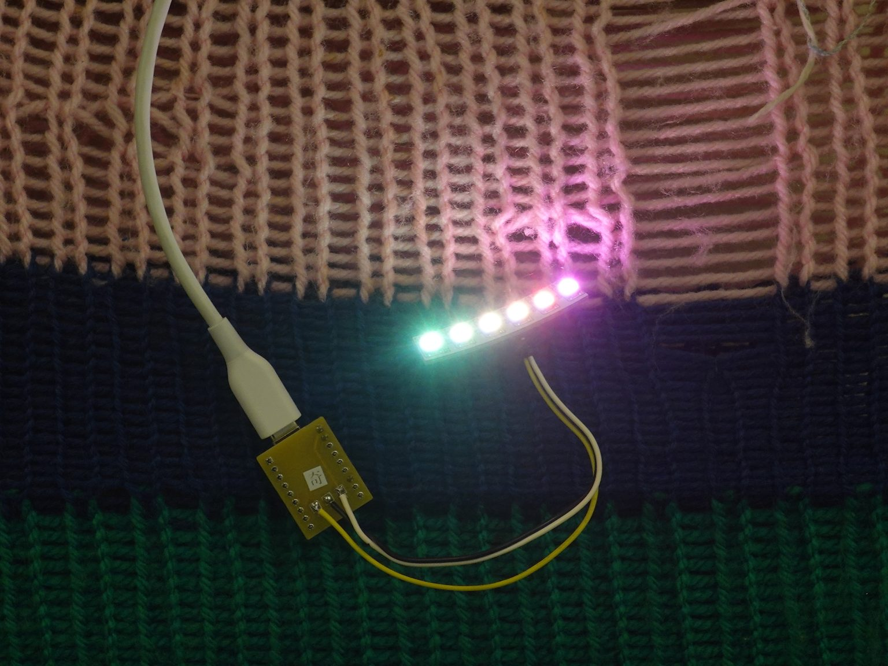

# プログラミングでLEDを七色に光らせる！ -KAMOE LAB-

## 本イベントについて

- 日時: 2026 2/7 (Sat) 10:00 - 
- 場所: 浜松市鴨江アートセンター 201号室
- [お知らせ&申し込みページはこちら](https://kamoeartcenter.org/events/202602007/)
- 6つのフルカラーLEDをマイコンに繋げた電子パーツを使って、プログラミングしながらLEDを光らせるワークショップです

## 当日のサンプルプログラム

